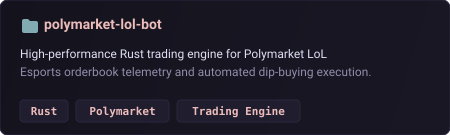
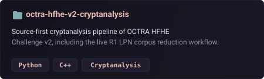
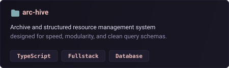
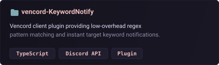
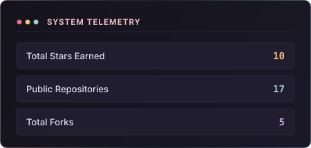
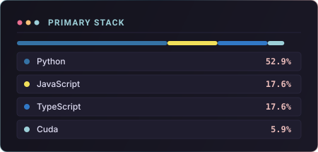

  

    

  

  

    <em>unregistered, but still active</em>
  

  

    
    
    
  

---

### Tech Stack & Tooling

  

---

### Highlighted Repositories

  <table border="0" cellspacing="0" cellpadding="0" width="100%">
    <tr>
      <td width="50%" align="center" valign="top">
        
      </td>
      <td width="50%" align="center" valign="top">
        
      </td>
    </tr>
    <tr>
      <td width="50%" align="center" valign="top">
        
      </td>
      <td width="50%" align="center" valign="top">
        
      </td>
    </tr>
  </table>

---

### Activity & Telemetry

  <table border="0" cellspacing="0" cellpadding="0" width="100%">
    <tr>
      <td width="50%" align="center" valign="top">
        
      </td>
      <td width="50%" align="center" valign="top">
        
      </td>
    </tr>
  </table>

---

### Contribution Activity

  <picture>
    <source media="(prefers-color-scheme: dark)" srcset="https://raw.githubusercontent.com/asbryx/asbryx/output/github-contribution-grid-snake-dark.svg">
    <source media="(prefers-color-scheme: light)" srcset="https://raw.githubusercontent.com/asbryx/asbryx/output/github-contribution-grid-snake.svg">
    
  </picture>

 

  ✦ <em>Designed & Maintained by <a href="https://github.com/asbryx">asbryx</a></em> ✦

 
